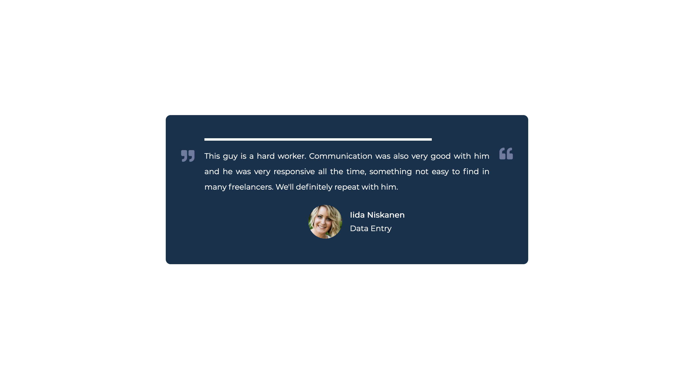

# Testimonial Box Switcher

## project notes

1. HTML

- container: progress bar, text, image, name, role

2. CSS

- animation for the progress bar 10s
- quote symbols: before, after

3. JavaScript

- array of testimonials and user
- setInterval

---

Challenge from Brad Traversy & Florin Pop on Udemy '50 Projects in 50 Days'

---

## Takeaways from the instructor
